# Flink案例：电商用户行为轨迹分析

### 环境介绍

- flink 1.13.0
- kafka-2.11.2.4
- 三台节点

## 电商用户行为分析

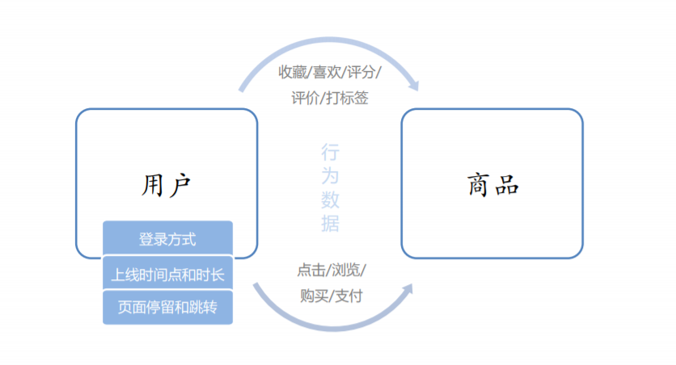

- 统计分析
  - 点击、浏览
  - 热门商品、近期热门商品、分类热门商品，流量统计
- 偏好统计
  - 收藏、喜欢、评分、打标签
  - 用户画像，推荐列表（结合特征工程和机器学习算法）
- 风险控制
  - 下订单、支付、登录
  - 刷单监控，订单失效监控，恶意登录（短时间内频繁登录失败）监控

### 项目模块设计

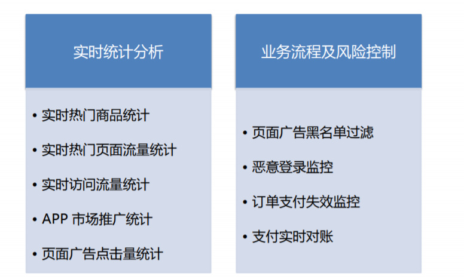

### 项目指标设计

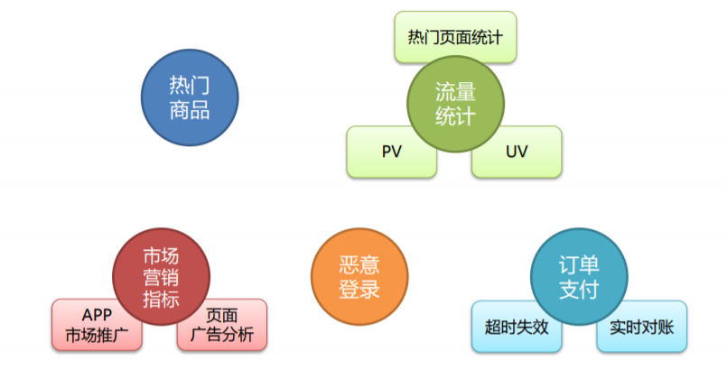

### 数据源解析

- 用户行为数据

  - UserBehavior.csv --- 543462, 1715, 1464116, pv, 1511658000

-  web 服务器日志

  - apache.log --- 66.249.73.135 - - 17/05/2015:10:05:40 +0000 GET /blog/tags/ipv6

- 数据结构

  - UserBehavior

  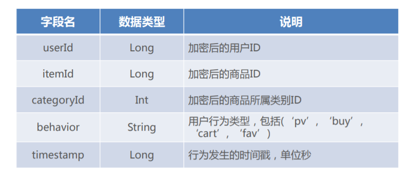

  - ApacheLogEvent

  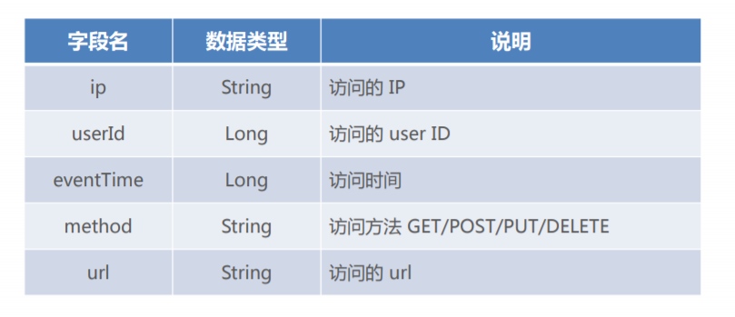

  

## 创建项目

***idea展示***

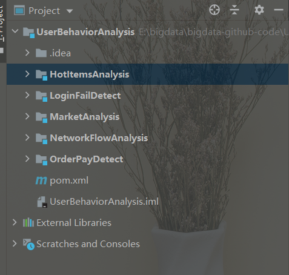

***项目展板***

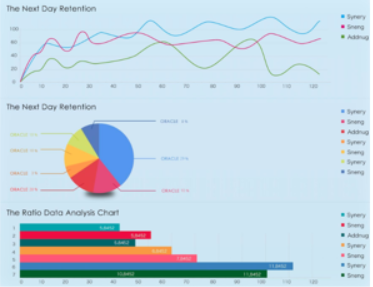

## 实时热门商品统计

数据量的话有48w条，但是在真实的场景中，是往往不够的。。。

### 基本需求

- 统计近一小时内的热门商品，每5分钟更新一次
- 热门度用浏览次数 PV 来衡量

### 解决思路

- 在所有用户行为数据中，过滤出浏览  PV  行为进行统计
- 构建滑动窗口，窗口长度为1小时，滑动距离为5分钟

### 流程图解析

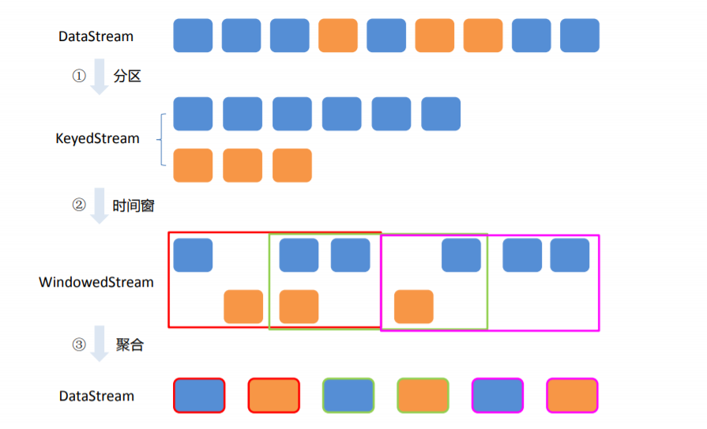

### ***按照商品Id进行分区***

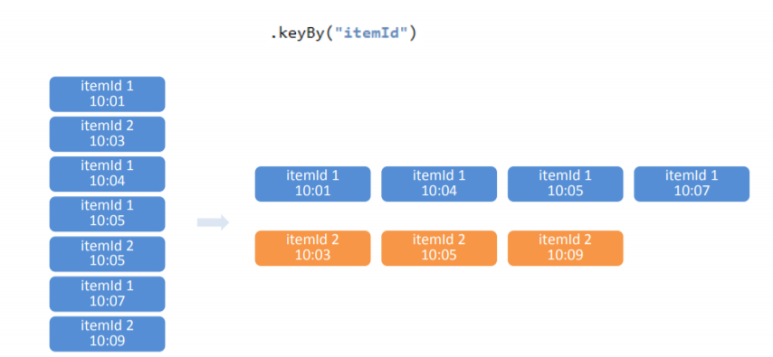

### 设置时间窗口

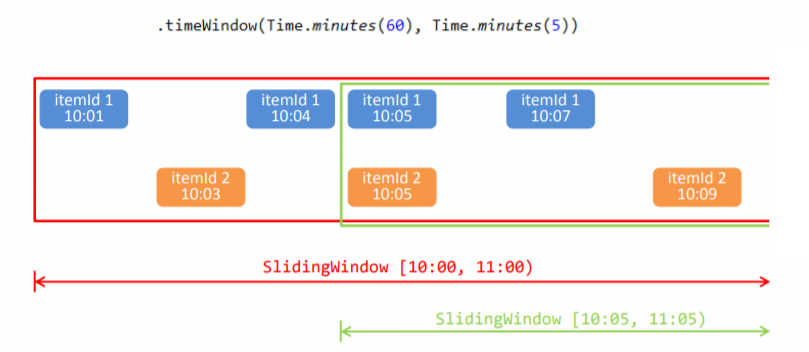

时间窗口（timeWindow）区间为左闭右开

### 同一份数据会被分发到不同的窗口

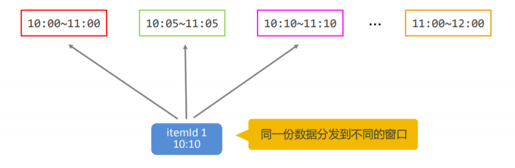

### 窗口聚合

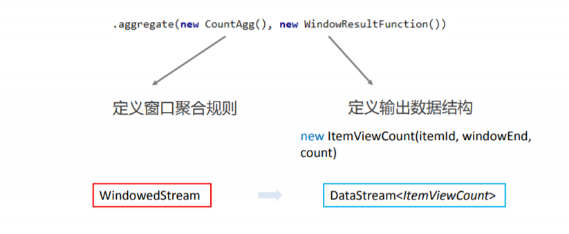

### 窗口聚合策略——每出现一条记录就加一

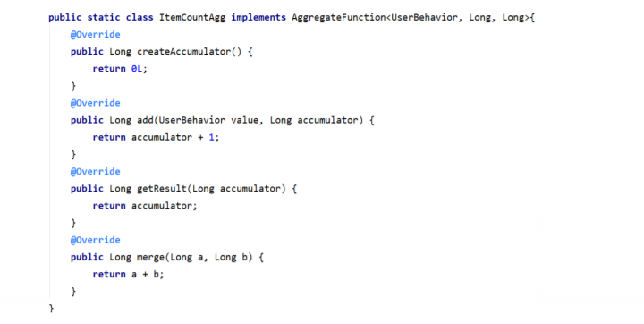

### 实现 AggregateFunction 接口

— interface AggregateFunction

### 定义输出结构

— ItemViewCount(itemId, windowEnd, count)

### 实现 WindowFunction 接口

~~~properties
– interface WindowFunction 
• IN: 输入为累加器的类型，Long 
• OUT: 窗口累加以后输出的类型为 
    ​	ItemViewCount(itemId: Long, windowEnd: Long, count: Long), 
    ​	windowEnd为窗口的 结束时间，也是窗口的唯一标识 
• KEY: Tuple泛型，在这里是 itemId，窗口根据itemId聚合 
• W: 聚合的窗口，w.getEnd 就能拿到窗口的结束时间
~~~

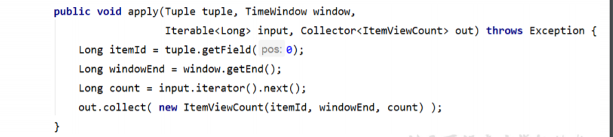

### 窗口聚合示例

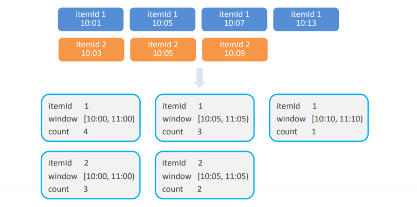

### 进行统计整理 

​	— keyBy(“windowEnd”)

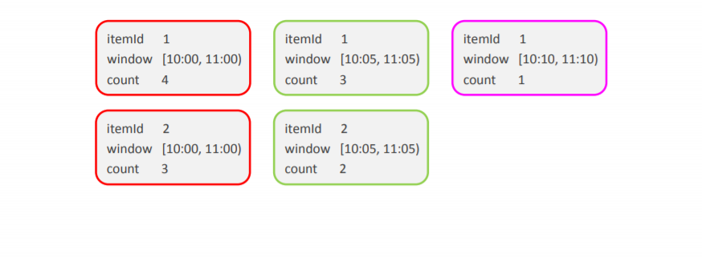

### 状态编程

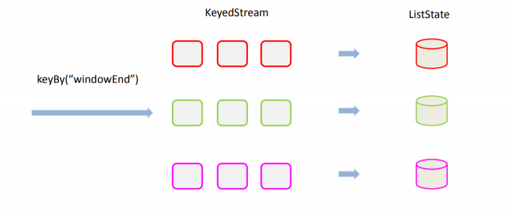

### 最终排序输出

- keyedProcessFunction
- 针对有状态流的底层API
- KeyedProcessFunction 会对分区后的每一条子流进行处理
- 以 windowEnd 作为 key，保证分流以后每一条流的数据都在一个时间窗口内
- 从 ListState 中读取当前流的状态，存储数据进行排序输出
- 用 ProcessFunction 来定义 KeyedStream 的处理逻辑 
- 分区之后，每个 KeyedStream 都有其自己的生命周期
  - open：初始化，在这里可以获取当前流的状态 
  - processElement：处理流中每一个元素时调用 
  - onTimer：定时调用，注册定时器 Timer 并触发之后的回调操作

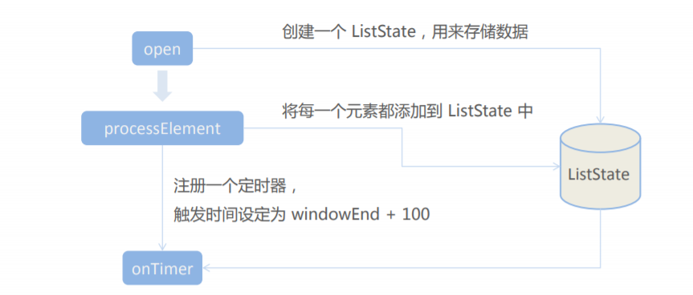

定时器触发时，相当于收到了大于 windowEnd + 100 的 watermark，可 以认为这时窗口已经收集到了所有数据，从 ListState 中读取进行处理。

### 测试效果

***Kafka数据***

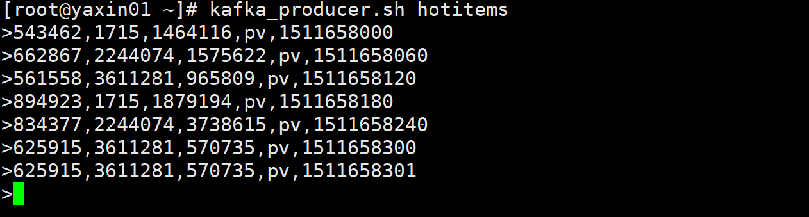

***展示结果***

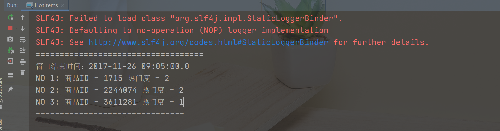

### 时间退回到一个小时之后的界面

937166,1715,2355072,pv,1511661600

~~~properties
===================================
窗口结束时间：2017-11-26 09:05:00.0
NO 1: 商品ID = 1715 热门度 = 2
NO 2: 商品ID = 2244074 热门度 = 2
NO 3: 商品ID = 3611281 热门度 = 1
===============================

===================================
窗口结束时间：2017-11-26 09:10:00.0
NO 1: 商品ID = 3611281 热门度 = 3
NO 2: 商品ID = 2244074 热门度 = 2
NO 3: 商品ID = 1715 热门度 = 2
===============================

===================================
窗口结束时间：2017-11-26 09:15:00.0
NO 1: 商品ID = 3611281 热门度 = 3
NO 2: 商品ID = 1715 热门度 = 2
NO 3: 商品ID = 2244074 热门度 = 2
===============================

===================================
窗口结束时间：2017-11-26 09:20:00.0
NO 1: 商品ID = 3611281 热门度 = 3
NO 2: 商品ID = 2244074 热门度 = 2
NO 3: 商品ID = 1715 热门度 = 2
===============================

===================================
窗口结束时间：2017-11-26 09:25:00.0
NO 1: 商品ID = 3611281 热门度 = 3
NO 2: 商品ID = 2244074 热门度 = 2
NO 3: 商品ID = 1715 热门度 = 2
===============================

===================================
窗口结束时间：2017-11-26 09:30:00.0
NO 1: 商品ID = 3611281 热门度 = 3
NO 2: 商品ID = 1715 热门度 = 2
NO 3: 商品ID = 2244074 热门度 = 2
===============================

===================================
窗口结束时间：2017-11-26 09:35:00.0
NO 1: 商品ID = 3611281 热门度 = 3
NO 2: 商品ID = 2244074 热门度 = 2
NO 3: 商品ID = 1715 热门度 = 2
===============================

===================================
窗口结束时间：2017-11-26 09:40:00.0
NO 1: 商品ID = 3611281 热门度 = 3
NO 2: 商品ID = 2244074 热门度 = 2
NO 3: 商品ID = 1715 热门度 = 2
===============================

===================================
窗口结束时间：2017-11-26 09:45:00.0
NO 1: 商品ID = 3611281 热门度 = 3
NO 2: 商品ID = 2244074 热门度 = 2
NO 3: 商品ID = 1715 热门度 = 2
===============================

===================================
窗口结束时间：2017-11-26 09:50:00.0
NO 1: 商品ID = 3611281 热门度 = 3
NO 2: 商品ID = 1715 热门度 = 2
NO 3: 商品ID = 2244074 热门度 = 2
===============================

===================================
窗口结束时间：2017-11-26 09:55:00.0
NO 1: 商品ID = 3611281 热门度 = 3
NO 2: 商品ID = 1715 热门度 = 2
NO 3: 商品ID = 2244074 热门度 = 2
===============================
~~~

### 启动顺序

~~~properties
1、热门商品统计
	=================== 第一种实现方式 ===================
	1、KafkaProducerUtil：
		模拟Kafka生产
		
	2、HotItems：
		分配时间：assignTimestampsAndWatermarks
		增量聚合函数：AggregateFunction
		全窗口函数：WindowFunction
		换成Kafka消费

	先启动1、在启动2
	
	模拟实时的场景一定要启动1，在启动2，才能更好的达到测试效果。。。。
~~~

## 实时流量统计 — 热门页面

### 基本需求 

- 从web服务器的日志中，统计实时的热门访问页面 
- 统计每分钟的ip访问量，取出访问量最大的5个地址，每5秒更新一次 

### 解决思路 

- 将 apache 服务器日志中的时间，转换为时间戳，作为 Event Time 
- 构建滑动窗口，窗口长度为1分钟，滑动距离为5秒

### 启动过程和遇见错误

### PV页面统计

~~~properties
NetworkFlowAnalysis 模块2
	热门页面 --- 只有一万条数据
	1、ApacheLogEvent
	2、PageViewCount
	3、UserBehavior
	4、HotPages
	5、AggregateFunction
	6、WindowFunction
	7、KeyedProcessFunction ---> 状态编程和触发器的使用
	记住关于Flink中的key是String还是Tumble类型的，是看我们返回的类型是什么，所以这个在编程的时候一定要特别注意。
	
	安装了redis，但是在启动的时候，要注意先启动./bin/redis-server 然后 在 ./bin/redis-cli -h 192.168.22.140

问题：
	Redis安装：
		编译安装的时候，需要把src里面的东西拿过来，单独启动server，要不然就会出现客户端连接不上
		
	求PV的时候，分组使用的是map给定一个固定的key
	并行测试：
		KeyBy，分组全部分到一个分区，避免用WindowAll分到同一个分区，这样就没有办法用到并行。。。
	解决办法：
		数据倾斜的问题？？？
		资源利用率较低，如何去解决，如何把key均匀分配到分区上，就会达到负载均衡的作用
		随机生成key，求HashCode % 可能会分配到同一个分区中，一般都比分区数大一点
		如何将每个分区全聚合操作。。。
		如何直接分组，然后sum，这样就是每个元素都得走一遍，效率极差
		应该使用AGG然后全窗口来进行实现。。。
		来一个数据处理一次，得到得URL，当前得分区里面，一个URL就有一个count值
~~~

#### 针对数据倾斜代码更改进

~~~properties
//  并行任务改进，设计随机key，解决数据倾斜问题
SingleOutputStreamOperator<PageViewCount> pvStream = dataStream.filter(data ->       "pv".equals(data.getBehavior()))
.map(new MapFunction<UserBehavior, Tuple2<Integer, Long>>() {
                    @Override
                    public Tuple2<Integer, Long> map(UserBehavior value) throws Exception {
                        Random random = new Random();
                        return new Tuple2<>(random.nextInt(10), 1L);
                    }
                })
.keyBy(data -> data.f0)
.timeWindow(Time.hours(1))
.aggregate(new PvCountAgg(), new PvCountResult());

// 将各分区数据汇总起来
DataStream<PageViewCount> pvResultStream = pvStream
.keyBy(PageViewCount::getWindowEnd)
.process(new TotalPvCount());

// 实现自定义处理函数，把相同窗口分组统计的count值叠加
public static class TotalPvCount extends KeyedProcessFunction<Long, PageViewCount, PageViewCount>{
    // 定义状态，保存当前的总count值
    ValueState<Long> totalCountState;
    @Override
    public void open(Configuration parameters) throws Exception {
        totalCountState = getRuntimeContext().getState(new ValueStateDescriptor<Long>("total-count", Long.class, 0L));
    }
    @Override
    public void processElement(PageViewCount value, Context ctx, Collector<PageViewCount> out) throws Exception {
        totalCountState.update( totalCountState.value() + value.getCount() );
        ctx.timerService().registerEventTimeTimer(value.getWindowEnd() + 1);
    }
    @Override
    public void onTimer(long timestamp, OnTimerContext ctx, Collector<PageViewCount> out) throws Exception {
        // 定时器触发，所有分组count值都到齐，直接输出当前的总count数量
        Long totalCount = totalCountState.value();
        out.collect(new PageViewCount("pv", ctx.getCurrentKey(), totalCount));
        // 清空状态
        totalCountState.clear();
    }
}
~~~

### UV页面统计

#### 布隆过滤器

~~~properties
timeWindowAll ---> AllWindowFunction
去重的话，我们第一种是采用的是全窗口的方式，就是采用的Set数据结构，对内存的压力比较大
如果UserId比较多的话，采用这种方式的就不太好了。。。
但是极端的场景下Redis，Redis可能也存不下
上亿的数据量，UserId 几十个字节到几百个字节
100Bit 10^8*100 = 10^10Bit 
10^3 = 1K
10^9 = 1G
10^10 = 10GB
这样的话太大了，一个窗口一个任务存了10个G，用来专门保存一个状态
如何进行优化：不太适合用存储工具做考虑
🍙采用存储结构 ---> 布隆过滤器，存储的是很大的位图，位图存放的bit，bitMap
思想：
01状态表示UserId是否存在，一个UserId，对应某一位，1表示存在，bitMap有多少1表示多少UserId存在
压缩的对应，100Bit ---> 1Bit
一亿占用空间 ---> 10^8Bit = 100Mb / 8 ---> 12.5Mb
每个UserId严格对应bitMap的每一位，用一个Hash计算做对应选择，UserId来了之后求HahsCode，对应的offset，一个bitMap对应 一个数组
不同UserId，HashCode出现HashCode碰撞，稍微出现一点散列，就会出现
扩充bitMap，处理一亿的数据，相当于全部分散开
原则：HashFunction选取，BitMap的扩充，碰撞概率无限趋向于零
布隆过滤器是一个概率性的算法。
主要问题：hash碰撞
特点重要重要的一点：Google Grave算法，现成的，传入一个所容忍的碰撞概率，默认是0.03。。。
不要做Process，定义一个计算规则，每来个计算触发一个计算，连接Redis，中间判断
以前做一个增量聚合函数也使用过这种思想，但是使用Redis来实现就会有点复杂
~~~

#### 自定义触发器

~~~java
// 自定义触发器
    public static class MyTrigger extends Trigger<UserBehavior, TimeWindow>{
        @Override
        public TriggerResult onElement(UserBehavior element, long timestamp, TimeWindow window, TriggerContext ctx) throws Exception {
            // 每一条数据来到，直接触发窗口计算，并且直接清空窗口
            return TriggerResult.FIRE_AND_PURGE;
        }

        @Override
        public TriggerResult onProcessingTime(long time, TimeWindow window, TriggerContext ctx) throws Exception {
            return TriggerResult.CONTINUE;
        }

        @Override
        public TriggerResult onEventTime(long time, TimeWindow window, TriggerContext ctx) throws Exception {
            return TriggerResult.CONTINUE;
        }

        @Override
        public void clear(TimeWindow window, TriggerContext ctx) throws Exception {
        }
    }
~~~

### 扩展算法

~~~properties
🍙自定义窗口触发器
🍙Flink自带的布隆过滤器
🍙MurmurHash
~~~

#### 如何计算大小

~~~properties
如何去计算布隆过滤器的大小：
	一亿数据去重
	2的整数倍大小Mb
	64Mb ---> 多少bit
	2^6 2^20 2^3 ---> 2^29
~~~

##### 在线计算

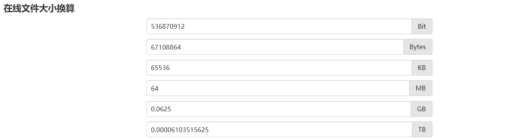

##### 计算器计算

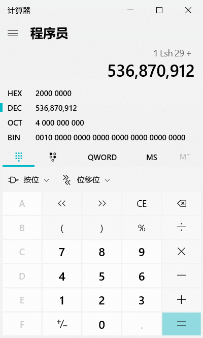

#### 自定义全窗口函数

~~~java

    // 实现自定义的处理函数
    public static class UvCountResultWithBloomFliter extends ProcessAllWindowFunction<UserBehavior, PageViewCount, TimeWindow>{
        // 定义jedis连接和布隆过滤器
        Jedis jedis;
        MyBloomFilter myBloomFilter;

        @Override
        public void open(Configuration parameters) throws Exception {
            jedis = new Jedis("yaxin01", 6379);
            myBloomFilter = new MyBloomFilter(1<<29);    // 要处理1亿个数据，用64MB大小的位图
        }

        @Override
        public void process(Context context, Iterable<UserBehavior> elements, Collector<PageViewCount> out) throws Exception {
            // 将位图和窗口count值全部存入redis，用windowEnd作为key
            Long windowEnd = context.window().getEnd();
            String bitmapKey = windowEnd.toString();
            // 把count值存成一张hash表
            String countHashName = "uv_count";
            String countKey = windowEnd.toString();

            // 1. 取当前的userId
            Long userId = elements.iterator().next().getUserId();

            // 2. 计算位图中的offset
            Long offset = myBloomFilter.hashCode(userId.toString(), 61);

            // 3. 用redis的getbit命令，判断对应位置的值
            Boolean isExist = jedis.getbit(bitmapKey, offset);

            if( !isExist ){
                // 如果不存在，对应位图位置置1
                jedis.setbit(bitmapKey, offset, true);

                // 更新redis中保存的count值
                Long uvCount = 0L;    // 初始count值
                String uvCountString = jedis.hget(countHashName, countKey);
                if( uvCountString != null && !"".equals(uvCountString) )
                    uvCount = Long.valueOf(uvCountString);
                jedis.hset(countHashName, countKey, String.valueOf(uvCount + 1));

                out.collect(new PageViewCount("uv", windowEnd, uvCount + 1));
            }
        }

        @Override
        public void close() throws Exception {
            jedis.close();
        }
    }
~~~

### 启动结果查看

~~~properties
如何去测试这个布隆过滤器：
	启动./bin/redis.server
	redis-cli -h 192.168.22.140
	然后启动RedisDesktop来进行查看
	启动UvWithBloomFilter

192.168.22.140:6379> 
192.168.22.140:6379> keys *
1) "uv_count"
2) "1511661600000"
192.168.22.140:6379> hget uv_count 1511661600000
"17414"

~~~

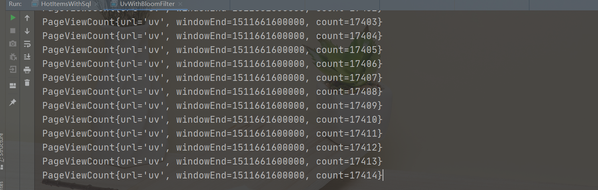

### 启动和总结要点

~~~properties
NetworkFlowAnalysis 模块2
    首先进行所有页面的统计，然后对PV，UV单独进行分析的处理。。。
    热门页面 --- 只有一万条数据
    1、ApacheLogEvent
    2、PageViewCount
    3、UserBehavior
    4、HotPages
    5、AggregateFunction
    6、WindowFunction
    7、KeyedProcessFunction ---> 状态编程和触发器的使用
    记住关于Flink中的key是String还是Tumble类型的，是看我们返回的类型是什么，所以这个在编程的时候一定要特别注意。

    安装了redis，但是在启动的时候，要注意先启动./bin/redis-server 然后 在 ./bin/redis-cli -h 192.168.22.140

pv 页面统计：
    做一个状态编程和触发器
    open ---> 做一个状态句柄，可以给定一个初始值，考虑刚开始就为null值的情况了
    processElement ---> 更新状态值、和注册触发器
    onTimer  ---> 定时器触发的时候，所有窗口的数据都是到齐了
    当前的TotalCount就是状态的值
    清空当前的状态 totalCounState.clear()

问题：
    Redis安装：
    编译安装的时候，需要把src里面的东西拿过来，单独启动server，要不然就会出现客户端连接不上

求PV的时候，分组使用的是map给定一个固定的key
并行测试：
KeyBy，分组全部分到一个分区，避免用WindowAll分到同一个分区，这样就没有办法用到并行。。。
解决办法：
    数据倾斜的问题？？？
    资源利用率较低，如何去解决，如何把key均匀分配到分区上，就会达到负载均衡的作用
    随机生成key，求HashCode % 可能会分配到同一个分区中，一般都比分区数大一点
    如何将每个分区全聚合操作。。。
    如何直接分组，然后sum，这样就是每个元素都得走一遍，效率极差
    应该使用AGG然后全窗口来进行实现。。。
    来一个数据处理一次，得到得URL，当前得分区里面，一个URL就有一个count值

UV独立访问用户数
    timeWindowAll ---> AllWindowFunction
    去重的话，我们第一种是采用的是全窗口的方式，就是采用的Set数据结构，对内存的压力比较大
    如果UserId比较多的话，采用这种方式的就不太好了。。。
    但是极端的场景下Redis，Redis可能也存不下
    上亿的数据量，UserId 几十个字节到几百个字节
    100Bit 10^8*100 = 10^10Bit 
    10^3 = 1K
    10^9 = 1G
    10^10 = 10GB
这样的话太大了，一个窗口一个任务存了10个G，用来专门保存一个状态
如何进行优化：不太适合用存储工具做考虑
🍙采用存储结构 ---> 布隆过滤器，存储的是很大的位图，位图存放的bit，bitMap
思想：
01状态表示UserId是否存在，一个UserId，对应某一位，1表示存在，bitMap有多少1表示多少UserId存在
压缩的对应，100Bit ---> 1Bit
一亿占用空间 ---> 10^8Bit = 100Mb / 8 ---> 12.5Mb
每个UserId严格对应bitMap的每一位，用一个Hash计算做对应选择，UserId来了之后求HahsCode，对应的offset，一个bitMap对应 一个数组
不同UserId，HashCode出现HashCode碰撞，稍微出现一点散列，就会出现
扩充bitMap，处理一亿的数据，相当于全部分散开
原则：HashFunction选取，BitMap的扩充，碰撞概率无限趋向于零
布隆过滤器是一个概率性的算法。
主要问题：hash碰撞
    特点重要重要的一点：Google Grave算法，现成的，传入一个所容忍的碰撞概率，默认是0.03。。。
    不要做Process，定义一个计算规则，每来个计算触发一个计算，连接Redis，中间判断
    以前做一个增量聚合函数也使用过这种思想，但是使用Redis来实现就会有点复杂

作为扩展：
    🍙自定义窗口触发器
    🍙Flink自带的布隆过滤器
    🍙MurmurHash

如何去计算布隆过滤器的大小：
    一亿数据去重
    2的整数倍大小Mb
    64Mb ---> 多少bit
    2^6 2^20 2^3 ---> 2^29

如何去测试这个布隆过滤器：
    启动./bin/redis.server
    redis-cli -h 192.168.22.140
    然后启动RedisDesktop来进行查看
    启动UvWithBloomFilter	
~~~

## 市场营销分析 - APP 市场推广统计

### 基本需求

- 从埋点日志中，统计 APP 市场推广的数据指标
- 按照不同的推广渠道，分别统计数据

### 解决思路

- 通过过滤日志中的用户行为，按照不同的渠道进行统计
- 可以用 process function 处理，得到自定义的输出数据信息

### 分渠道统计

#### 代码

~~~java
package com.wmy.market_analysis.process;

import com.wmy.market_analysis.beans.ChannelPromotionCount;
import com.wmy.market_analysis.beans.MarketingUserBehavior;
import org.apache.flink.api.common.functions.AggregateFunction;
import org.apache.flink.api.java.tuple.Tuple;
import org.apache.flink.streaming.api.TimeCharacteristic;
import org.apache.flink.streaming.api.datastream.DataStream;
import org.apache.flink.streaming.api.datastream.SingleOutputStreamOperator;
import org.apache.flink.streaming.api.environment.StreamExecutionEnvironment;
import org.apache.flink.streaming.api.functions.AscendingTimestampExtractor;
import org.apache.flink.streaming.api.functions.source.SourceFunction;
import org.apache.flink.streaming.api.functions.windowing.ProcessWindowFunction;
import org.apache.flink.streaming.api.windowing.time.Time;
import org.apache.flink.streaming.api.windowing.windows.TimeWindow;
import org.apache.flink.util.Collector;

import java.sql.Timestamp;
import java.util.Arrays;
import java.util.List;
import java.util.Random;

/**
 * ClassName:AppMarketingByChannel
 * Package:com.wmy.market_analysis.process
 *
 * @date:2021/6/25 9:42
 * @author:数仓开发工程师
 * @email:2647716549@qq.com
 * @Description: 按照不同的渠道做的一个市场的推广的统计
 */
public class AppMarketingByChannel {
    public static void main(String[] args) throws Exception{
        StreamExecutionEnvironment env = StreamExecutionEnvironment.getExecutionEnvironment();
        env.setParallelism(1);
        env.setStreamTimeCharacteristic(TimeCharacteristic.EventTime);

        // 1. 从自定义数据源中读取数据
        DataStream<MarketingUserBehavior> dataStream = env.addSource( new SimulatedMarketingUserBehaviorSource() )
                .assignTimestampsAndWatermarks(new AscendingTimestampExtractor<MarketingUserBehavior>() {
                    @Override
                    public long extractAscendingTimestamp(MarketingUserBehavior element) {
                        return element.getTimestamp();
                    }
                });

        // 2. 分渠道开窗统计
        SingleOutputStreamOperator<ChannelPromotionCount> resultStream = dataStream
                .filter(data -> !"UNINSTALL".equals(data.getBehavior()))
                .keyBy("channel", "behavior")
                .timeWindow(Time.hours(1), Time.seconds(5))    // 定义滑窗
                .aggregate(new MarketingCountAgg(), new MarketingCountResult());

        resultStream.print();

        env.execute("app marketing by channel job");
    }

    // 实现自定义的模拟市场用户行为数据源
    public static class SimulatedMarketingUserBehaviorSource implements SourceFunction<MarketingUserBehavior>{
        // 控制是否正常运行的标识位
        Boolean running = true;

        // 定义用户行为和渠道的范围
        List<String> behaviorList = Arrays.asList("CLICK", "DOWNLOAD", "INSTALL", "UNINSTALL");
        List<String> channelList = Arrays.asList("app store", "wechat", "weibo");

        Random random = new Random();

        @Override
        public void run(SourceContext<MarketingUserBehavior> ctx) throws Exception {
            while(running){
                // 随机生成所有字段
                Long id = random.nextLong();
                String behavior = behaviorList.get( random.nextInt(behaviorList.size()) );
                String channel = channelList.get( random.nextInt(channelList.size()) );
                Long timestamp = System.currentTimeMillis();

                // 发出数据
                ctx.collect(new MarketingUserBehavior(id, behavior, channel, timestamp));

                Thread.sleep(100L);
            }
        }

        @Override
        public void cancel() {
            running = false;
        }
    }

    // 实现自定义的增量聚合函数
    public static class MarketingCountAgg implements AggregateFunction<MarketingUserBehavior, Long, Long>{
        @Override
        public Long createAccumulator() {
            return 0L;
        }

        @Override
        public Long add(MarketingUserBehavior value, Long accumulator) {
            return accumulator + 1;
        }

        @Override
        public Long getResult(Long accumulator) {
            return accumulator;
        }

        @Override
        public Long merge(Long a, Long b) {
            return a + b;
        }
    }

    // 实现自定义的全窗口函数
    public static class MarketingCountResult extends ProcessWindowFunction<Long, ChannelPromotionCount, Tuple, TimeWindow>{
        @Override
        public void process(Tuple tuple, Context context, Iterable<Long> elements, Collector<ChannelPromotionCount> out) throws Exception {
            String channel = tuple.getField(0);
            String behavior = tuple.getField(1);
            String windowEnd = new Timestamp(context.window().getEnd()).toString();
            Long count = elements.iterator().next();

            out.collect(new ChannelPromotionCount(channel, behavior, windowEnd, count));
        }
    }
}

~~~

#### 展示结果

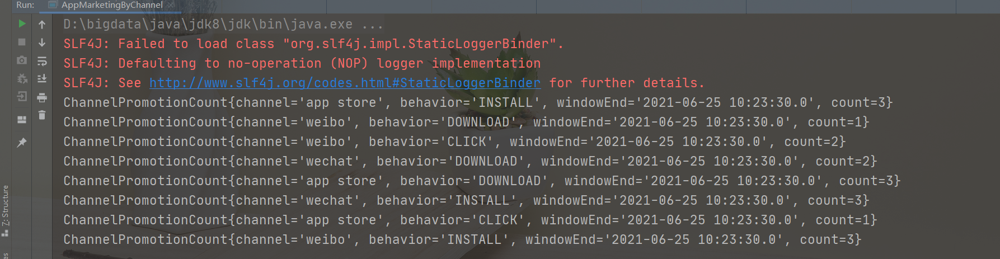

### 全量统计

#### 代码

~~~java
package com.wmy.market_analysis.process;

import com.wmy.market_analysis.beans.ChannelPromotionCount;
import com.wmy.market_analysis.beans.MarketingUserBehavior;
import org.apache.flink.api.common.functions.AggregateFunction;
import org.apache.flink.api.common.functions.MapFunction;
import org.apache.flink.api.java.tuple.Tuple;
import org.apache.flink.api.java.tuple.Tuple2;
import org.apache.flink.streaming.api.TimeCharacteristic;
import org.apache.flink.streaming.api.datastream.DataStream;
import org.apache.flink.streaming.api.datastream.SingleOutputStreamOperator;
import org.apache.flink.streaming.api.environment.StreamExecutionEnvironment;
import org.apache.flink.streaming.api.functions.timestamps.AscendingTimestampExtractor;
import org.apache.flink.streaming.api.functions.windowing.WindowFunction;
import org.apache.flink.streaming.api.windowing.time.Time;
import org.apache.flink.streaming.api.windowing.windows.TimeWindow;
import org.apache.flink.util.Collector;

import java.sql.Timestamp;

/**
 * ClassName:AppMarketingStatistics
 * Package:com.wmy.market_analysis.process
 *
 * @date:2021/6/25 10:19
 * @author:数仓开发工程师
 * @email:2647716549@qq.com
 * @Description: 不分市场的全量统计
 */
public class AppMarketingStatistics {
    public static void main(String[] args) throws Exception{
        StreamExecutionEnvironment env = StreamExecutionEnvironment.getExecutionEnvironment();
        env.setParallelism(1);
        env.setStreamTimeCharacteristic(TimeCharacteristic.EventTime);

        // 1. 从自定义数据源中读取数据
        DataStream<MarketingUserBehavior> dataStream = env.addSource( new AppMarketingByChannel.SimulatedMarketingUserBehaviorSource() )
                .assignTimestampsAndWatermarks(new AscendingTimestampExtractor<MarketingUserBehavior>() {
                    @Override
                    public long extractAscendingTimestamp(MarketingUserBehavior element) {
                        return element.getTimestamp();
                    }
                });

        // 2. 开窗统计总量
        SingleOutputStreamOperator<ChannelPromotionCount> resultStream = dataStream
                .filter(data -> !"UNINSTALL".equals(data.getBehavior()))
                .map(new MapFunction<MarketingUserBehavior, Tuple2<String, Long>>() {
                    @Override
                    public Tuple2<String, Long> map(MarketingUserBehavior value) throws Exception {
                        return new Tuple2<>("total", 1L);
                    }
                })
                .keyBy(0)
                .timeWindow(Time.hours(1), Time.seconds(5))    // 定义滑窗
                .aggregate( new MarketingStatisticsAgg(), new MarketingStatisticsResult() );

        resultStream.print();

        env.execute("app marketing by channel job");
    }

    public static class MarketingStatisticsAgg implements AggregateFunction<Tuple2<String, Long>, Long, Long>{
        @Override
        public Long createAccumulator() {
            return 0L;
        }

        @Override
        public Long add(Tuple2<String, Long> value, Long accumulator) {
            return accumulator + 1;
        }

        @Override
        public Long getResult(Long accumulator) {
            return accumulator;
        }

        @Override
        public Long merge(Long a, Long b) {
            return a + b;
        }
    }

    public static class MarketingStatisticsResult implements WindowFunction<Long, ChannelPromotionCount, Tuple, TimeWindow>{
        @Override
        public void apply(Tuple tuple, TimeWindow window, Iterable<Long> input, Collector<ChannelPromotionCount> out) throws Exception {
            String windowEnd = new Timestamp( window.getEnd() ).toString();
            Long count = input.iterator().next();

            out.collect(new ChannelPromotionCount("total", "total", windowEnd, count));
        }
    }
}
~~~

#### 展示结果

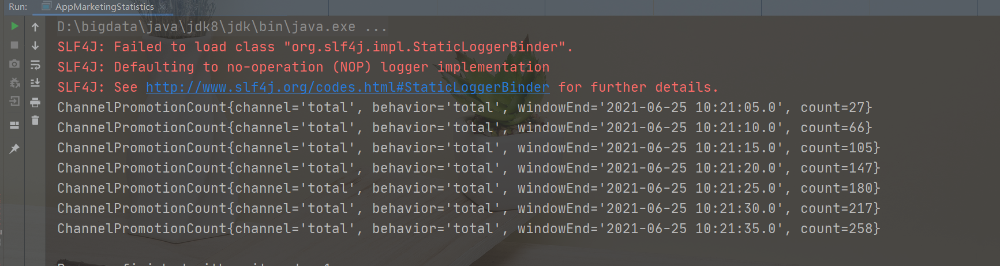

### 广告点击|黑名单过滤

#### 触发器时间设置分析

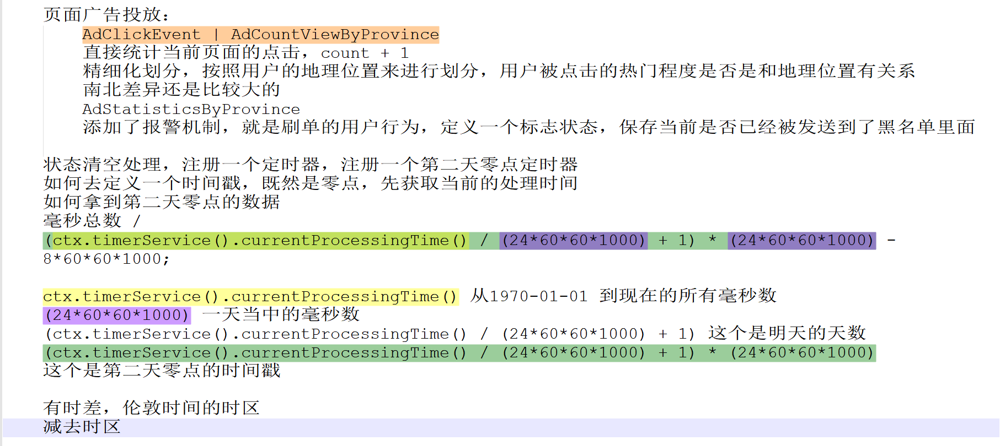

#### 代码

~~~properties
package com.wmy.market_analysis.process;

import com.wmy.market_analysis.beans.AdClickEvent;
import com.wmy.market_analysis.beans.AdCountViewByProvince;
import com.wmy.market_analysis.beans.BlackListUserWarning;
import org.apache.flink.api.common.functions.AggregateFunction;
import org.apache.flink.api.common.state.ValueState;
import org.apache.flink.api.common.state.ValueStateDescriptor;
import org.apache.flink.api.java.tuple.Tuple;
import org.apache.flink.configuration.Configuration;
import org.apache.flink.streaming.api.TimeCharacteristic;
import org.apache.flink.streaming.api.datastream.DataStream;
import org.apache.flink.streaming.api.datastream.SingleOutputStreamOperator;
import org.apache.flink.streaming.api.environment.StreamExecutionEnvironment;
import org.apache.flink.streaming.api.functions.KeyedProcessFunction;
import org.apache.flink.streaming.api.functions.timestamps.AscendingTimestampExtractor;
import org.apache.flink.streaming.api.functions.windowing.WindowFunction;
import org.apache.flink.streaming.api.windowing.time.Time;
import org.apache.flink.streaming.api.windowing.windows.TimeWindow;
import org.apache.flink.util.Collector;
import org.apache.flink.util.OutputTag;

import java.net.URL;
import java.sql.Timestamp;

/**
 * ClassName:AdStatisticsByProvince
 * Package:com.wmy.market_analysis.process
 *
 * @date:2021/6/25 10:33
 * @author:数仓开发工程师
 * @email:2647716549@qq.com
 * @Description: 通过省份来分析统计广告投放 --- 测数据 AdClickLog.csv
 */
public class AdStatisticsByProvince {
    public static void main(String[] args) throws Exception{
        StreamExecutionEnvironment env = StreamExecutionEnvironment.getExecutionEnvironment();
        env.setStreamTimeCharacteristic(TimeCharacteristic.EventTime);
        env.setParallelism(1);

        // 1. 从文件中读取数据
        DataStream<AdClickEvent> adClickEventStream = env.readTextFile("E:\\bigdata\\bigdata-github-code\\UserBehaviorAnalysis\\MarketAnalysis\\src\\main\\resources\\AdClickLog.csv")
                .map( line -> {
                    String[] fields = line.split(",");
                    return new AdClickEvent(new Long(fields[0]), new Long(fields[1]), fields[2], fields[3], new Long(fields[4]));
                } )
                .assignTimestampsAndWatermarks(new AscendingTimestampExtractor<AdClickEvent>() {
                    @Override
                    public long extractAscendingTimestamp(AdClickEvent element) {
                        return element.getTimestamp() * 1000L;
                    }
                });

        // 2. 对同一个用户点击同一个广告的行为进行检测报警
        SingleOutputStreamOperator<AdClickEvent> filterAdClickStream = adClickEventStream
                .keyBy("userId", "adId")    // 基于用户id和广告id做分组
                .process(new FilterBlackListUser(100));

        // 3. 基于省份分组，开窗聚合
        SingleOutputStreamOperator<AdCountViewByProvince> adCountResultStream = filterAdClickStream
                .keyBy(AdClickEvent::getProvince)
                .timeWindow(Time.hours(1), Time.minutes(5))     // 定义滑窗，5分钟输出一次
                .aggregate(new AdCountAgg(), new AdCountResult());

        adCountResultStream.print();
        filterAdClickStream.getSideOutput(new OutputTag<BlackListUserWarning>("blacklist"){}).print("blacklist-user");

        env.execute("ad count by province job");
    }

    public static class AdCountAgg implements AggregateFunction<AdClickEvent, Long, Long>{
        @Override
        public Long createAccumulator() {
            return 0L;
        }

        @Override
        public Long add(AdClickEvent value, Long accumulator) {
            return accumulator + 1;
        }

        @Override
        public Long getResult(Long accumulator) {
            return accumulator;
        }

        @Override
        public Long merge(Long a, Long b) {
            return a + b;
        }
    }

    public static class AdCountResult implements WindowFunction<Long, AdCountViewByProvince, String, TimeWindow>{
        @Override
        public void apply(String province, TimeWindow window, Iterable<Long> input, Collector<AdCountViewByProvince> out) throws Exception {
            String windowEnd = new Timestamp( window.getEnd() ).toString();
            Long count = input.iterator().next();
            out.collect( new AdCountViewByProvince(province, windowEnd, count) );
        }
    }

    // 实现自定义处理函数
    public static class FilterBlackListUser extends KeyedProcessFunction<Tuple, AdClickEvent, AdClickEvent>{
        // 定义属性：点击次数上限
        private Integer countUpperBound;

        public FilterBlackListUser(Integer countUpperBound) {
            this.countUpperBound = countUpperBound;
        }

        // 定义状态，保存当前用户对某一广告的点击次数
        ValueState<Long> countState;
        // 定义一个标志状态，保存当前用户是否已经被发送到了黑名单里
        ValueState<Boolean> isSentState;

        @Override
        public void open(Configuration parameters) throws Exception {
            countState = getRuntimeContext().getState(new ValueStateDescriptor<Long>("ad-count", Long.class, 0L));
            isSentState = getRuntimeContext().getState(new ValueStateDescriptor<Boolean>("is-sent", Boolean.class, false));
        }

        @Override
        public void processElement(AdClickEvent value, Context ctx, Collector<AdClickEvent> out) throws Exception {
            // 判断当前用户对同一广告的点击次数，如果不够上限，就count加1正常输出；如果达到上限，直接过滤掉，并侧输出流输出黑名单报警
            // 首先获取当前的count值
            Long curCount = countState.value();

            // 1. 判断是否是第一个数据，如果是的话，注册一个第二天0点的定时器
            if( curCount == 0 ){
                Long ts = (ctx.timerService().currentProcessingTime() / (24*60*60*1000) + 1) * (24*60*60*1000) - 8*60*60*1000;
//                System.out.println(new Timestamp(ts));
                ctx.timerService().registerProcessingTimeTimer(ts);
            }

            // 2. 判断是否报警
            if( curCount >= countUpperBound ){
                // 判断是否输出到黑名单过，如果没有的话就输出到侧输出流
                if( !isSentState.value() ){
                    isSentState.update(true);    // 更新状态
                    ctx.output( new OutputTag<BlackListUserWarning>("blacklist"){},
                            new BlackListUserWarning(value.getUserId(), value.getAdId(), "click over " + countUpperBound + "times."));
                }
                return;    // 不再执行下面操作
            }

            // 如果没有返回，点击次数加1，更新状态，正常输出当前数据到主流
            countState.update(curCount + 1);
            out.collect(value);
        }

        @Override
        public void onTimer(long timestamp, OnTimerContext ctx, Collector<AdClickEvent> out) throws Exception {
            // 清空所有状态
            countState.clear();
            isSentState.clear();
        }
    }
}

~~~

#### 展示结果

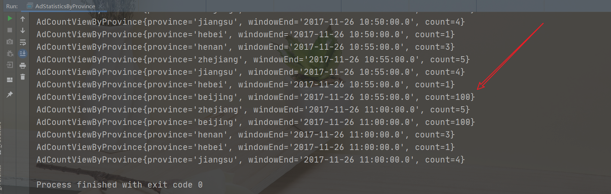

可以看出是有问题，说明这个过滤是很有效果的

## 恶意登录监控

### 基本需求

- 用户在短时间内频繁登录失败，有程序恶意攻击的可能
- 同一用户（可以是不同IP）在2秒内连续两次登录失败，需要报警

### 解决思路

- 将用户的登录失败行为存入 ListState，设定定时器2秒后触发，查看 ListState 中有几次失败登录
- 更加精确的检测，可以使用 CEP 库实现事件流的模式匹配

### 代码

~~~java
package com.wmy.loginfailDetect.proccess;

import com.wmy.loginfailDetect.beans.LoginEvent;
import com.wmy.loginfailDetect.beans.LoginFailWarning;
import org.apache.flink.api.common.state.ListState;
import org.apache.flink.api.common.state.ListStateDescriptor;
import org.apache.flink.api.common.state.ValueState;
import org.apache.flink.api.common.state.ValueStateDescriptor;
import org.apache.flink.configuration.Configuration;
import org.apache.flink.shaded.guava18.com.google.common.collect.Lists;
import org.apache.flink.streaming.api.TimeCharacteristic;
import org.apache.flink.streaming.api.datastream.DataStream;
import org.apache.flink.streaming.api.datastream.SingleOutputStreamOperator;
import org.apache.flink.streaming.api.environment.StreamExecutionEnvironment;
import org.apache.flink.streaming.api.functions.KeyedProcessFunction;
import org.apache.flink.streaming.api.functions.timestamps.BoundedOutOfOrdernessTimestampExtractor;
import org.apache.flink.streaming.api.windowing.time.Time;
import org.apache.flink.util.Collector;

import java.net.URL;
import java.util.ArrayList;
import java.util.Iterator;

/**
 * ClassName:LoginFail
 * Package:com.wmy.loginfailDetect.proccess
 *
 * @date:2021/6/25 11:46
 * @author:数仓开发工程师
 * @email:2647716549@qq.com
 * @Description: 恶意登录事件的处理
 */
public class LoginFail {
    public static void main(String[] args) throws Exception{
        StreamExecutionEnvironment env = StreamExecutionEnvironment.getExecutionEnvironment();
        env.setParallelism(1);
        env.setStreamTimeCharacteristic(TimeCharacteristic.EventTime);

        // 1. 从文件中读取数据
        URL resource = LoginFail.class.getResource("/LoginLog.csv");
        DataStream<LoginEvent> loginEventStream = env.readTextFile(resource.getPath())
                .map(line -> {
                    String[] fields = line.split(",");
                    return new LoginEvent(new Long(fields[0]), fields[1], fields[2], new Long(fields[3]));
                })
                .assignTimestampsAndWatermarks(new BoundedOutOfOrdernessTimestampExtractor<LoginEvent>(Time.seconds(3)) {
                    @Override
                    public long extractTimestamp(LoginEvent element) {
                        return element.getTimestamp() * 1000L;
                    }
                });

        // 自定义处理函数检测连续登录失败事件
        SingleOutputStreamOperator<LoginFailWarning> warningStream = loginEventStream
                .keyBy(LoginEvent::getUserId)
                .process(new LoginFailDetectWarning(2));

        warningStream.print();

        env.execute("login fail detect job");
    }

    // 实现自定义KeyedProcessFunction
    public static class LoginFailDetectWarning extends KeyedProcessFunction<Long, LoginEvent, LoginFailWarning> {
        // 定义属性，最大连续登录失败次数
        private Integer maxFailTimes;

        public LoginFailDetectWarning(Integer maxFailTimes) {
            this.maxFailTimes = maxFailTimes;
        }

        // 定义状态：保存2秒内所有的登录失败事件
        ListState<LoginEvent> loginFailEventListState;

        @Override
        public void open(Configuration parameters) throws Exception {
            loginFailEventListState = getRuntimeContext().getListState(new ListStateDescriptor<LoginEvent>("login-fail-list", LoginEvent.class));
        }

        // 以登录事件作为判断报警的触发条件，不再注册定时器
        @Override
        public void processElement(LoginEvent value, Context ctx, Collector<LoginFailWarning> out) throws Exception {
            // 判断当前事件登录状态
            if( "fail".equals(value.getLoginState()) ){
                // 1. 如果是登录失败，获取状态中之前的登录失败事件，继续判断是否已有失败事件
                Iterator<LoginEvent> iterator = loginFailEventListState.get().iterator();
                if( iterator.hasNext() ){
                    // 1.1 如果已经有登录失败事件，继续判断时间戳是否在2秒之内
                    // 获取已有的登录失败事件
                    LoginEvent firstFailEvent = iterator.next();
                    if( value.getTimestamp() - firstFailEvent.getTimestamp() <= 2 ){
                        // 1.1.1 如果在2秒之内，输出报警
                        out.collect( new LoginFailWarning(value.getUserId(), firstFailEvent.getTimestamp(), value.getTimestamp(), "login fail 2 times in 2s") );
                    }

                    // 不管报不报警，这次都已处理完毕，直接更新状态
                    loginFailEventListState.clear();
                    loginFailEventListState.add(value);
                } else {
                    // 1.2 如果没有登录失败，直接将当前事件存入ListState
                    loginFailEventListState.add(value);
                }
            } else {
                // 2. 如果是登录成功，直接清空状态
                loginFailEventListState.clear();
            }
        }
    }
}
~~~

### 展示结果

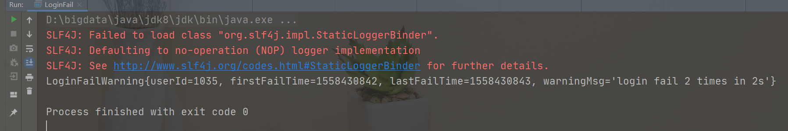

### 使用CEP来进行监测

#### 代码

~~~java
package com.wmy.loginfailDetect.proccess;

import com.wmy.loginfailDetect.beans.LoginEvent;
import com.wmy.loginfailDetect.beans.LoginFailWarning;
import org.apache.flink.cep.CEP;
import org.apache.flink.cep.PatternSelectFunction;
import org.apache.flink.cep.PatternStream;
import org.apache.flink.cep.pattern.Pattern;
import org.apache.flink.cep.pattern.conditions.SimpleCondition;
import org.apache.flink.streaming.api.TimeCharacteristic;
import org.apache.flink.streaming.api.datastream.DataStream;
import org.apache.flink.streaming.api.datastream.SingleOutputStreamOperator;
import org.apache.flink.streaming.api.environment.StreamExecutionEnvironment;
import org.apache.flink.streaming.api.functions.timestamps.BoundedOutOfOrdernessTimestampExtractor;
import org.apache.flink.streaming.api.windowing.time.Time;

import java.net.URL;
import java.util.List;
import java.util.Map;

/**
 * ClassName:LoginFailWithCep
 * Package:com.wmy.loginfailDetect.proccess
 *
 * @date:2021/6/25 14:41
 * @author:数仓开发工程师
 * @email:2647716549@qq.com
 * @Description:
 */
public class LoginFailWithCep {
    public static void main(String[] args) throws Exception {
        StreamExecutionEnvironment env = StreamExecutionEnvironment.getExecutionEnvironment();
        env.setParallelism(1);
        env.setStreamTimeCharacteristic(TimeCharacteristic.EventTime);

        // 1. 从文件中读取数据
        URL resource = LoginFailWithCep.class.getResource("/LoginLog.csv");
        DataStream<LoginEvent> loginEventStream = env.readTextFile(resource.getPath())
                .map(line -> {
                    String[] fields = line.split(",");
                    return new LoginEvent(new Long(fields[0]), fields[1], fields[2], new Long(fields[3]));
                })
                .assignTimestampsAndWatermarks(new BoundedOutOfOrdernessTimestampExtractor<LoginEvent>(Time.seconds(3)) {
                    @Override
                    public long extractTimestamp(LoginEvent element) {
                        return element.getTimestamp() * 1000L;
                    }
                });

        // 定义一个匹配模式 --- 登录失败的模式
        // firstFail -> SecondFail, within 2 seconds
        Pattern<LoginEvent, LoginEvent> loginFailPattern = Pattern
                .<LoginEvent>begin("firstFail") // 只是给定一个名称而已
                .where(new SimpleCondition<LoginEvent>() {
                    @Override
                    public boolean filter(LoginEvent value) throws Exception {
                        return "fail".equals(value.getLoginState()); // 筛选登录状态等于fail，和filter类似
                    }
                })
                // 因为中间，不能有成功的事件
                .next("secondFail")
                .where(new SimpleCondition<LoginEvent>() {
                    @Override
                    public boolean filter(LoginEvent value) throws Exception {
                        return "fail".equals(value.getLoginState());
                    }
                })
                // 事件限制，类似于手动开一个窗口
                .within(Time.seconds(2));

        // 将匹配模式应用导数据流上，得到一个pattern stream
        // 不是针对所有的数据进行检测，类似于两条流做连接的操作
        PatternStream<LoginEvent> patternStream = CEP.pattern(
                loginEventStream
                        .keyBy(LoginEvent::getUserId),
                loginFailPattern);

        // 检出符合条件的复杂时间，进行转换处理，得到报警信息map CoMap
        // 检测到的是一组事件，select 提取出来的都是LoginEvent，保存到Map数据结构中，key --- firstFail secondFail
        // 每组都有很多个事件，最后返回的是
        SingleOutputStreamOperator<LoginFailWarning> warningStream = patternStream
                .select(new LoginFailMatchDetectWarning());

        warningStream.print();

        env.execute("login fail detect with cep job");
    }

    // 实现自定义的PatternSelectFunction接口
    public static class LoginFailMatchDetectWarning implements PatternSelectFunction<LoginEvent,LoginFailWarning> {
        @Override
        public LoginFailWarning select(Map<String, List<LoginEvent>> pattern) throws Exception {
            LoginEvent firstFailEvent = pattern.get("firstFail").get(0); // 就是之前定义的模式匹配的内容，也可以当成一个迭代器的内容
            LoginEvent secondFailEvent = pattern.get("secondFail").get(0);
            return new LoginFailWarning(firstFailEvent.getUserId(), firstFailEvent.getTimestamp(), secondFailEvent.getTimestamp(), "login fail 2 times");
        }
    }
}
~~~

#### 展示结果

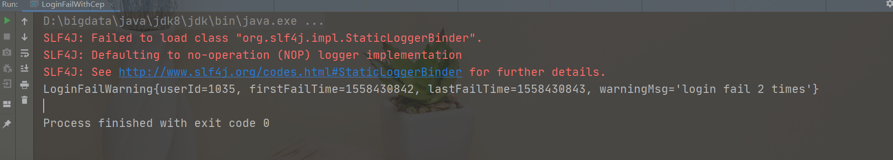

## 订单支付监控

### 基本需求

- 用户下单之后，应设置订单失效时间，以提高用户支付的意愿，并降 低系统风险
- 用户下单后15分钟未支付，则输出监控信息

### 解决思路

- 利用 CEP 库进行事件流的模式匹配，并设定匹配的时间间隔
- 也可以利用状态编程，用 process function 实现处理逻辑

### 匹配订单支付超时 - CEP

#### 代码

~~~java
package com.wmy.orderPay.process;

import com.wmy.orderPay.beans.OrderEvent;
import com.wmy.orderPay.beans.OrderResult;
import org.apache.flink.cep.CEP;
import org.apache.flink.cep.PatternSelectFunction;
import org.apache.flink.cep.PatternStream;
import org.apache.flink.cep.PatternTimeoutFunction;
import org.apache.flink.cep.pattern.Pattern;
import org.apache.flink.cep.pattern.conditions.SimpleCondition;
import org.apache.flink.streaming.api.TimeCharacteristic;
import org.apache.flink.streaming.api.datastream.DataStream;
import org.apache.flink.streaming.api.datastream.SingleOutputStreamOperator;
import org.apache.flink.streaming.api.environment.StreamExecutionEnvironment;
import org.apache.flink.streaming.api.functions.AscendingTimestampExtractor;
import org.apache.flink.streaming.api.windowing.time.Time;
import org.apache.flink.util.OutputTag;

import java.net.URL;
import java.util.List;
import java.util.Map;

/**
 * ClassName:OrderPayTimeOut
 * Package:com.wmy.orderPay.process
 *
 * @date:2021/6/25 17:25
 * @author:数仓开发工程师
 * @email:2647716549@qq.com
 * @Description: 订单超时事件
 */
public class OrderPayTimeOut {
    public static void main(String[] args) throws Exception {
        // 创建环境
        StreamExecutionEnvironment env = StreamExecutionEnvironment.getExecutionEnvironment();
        env.setStreamTimeCharacteristic(TimeCharacteristic.EventTime);
        env.setParallelism(1);

        // 读取数据并转换为POJO类型
        URL resource = OrderPayTimeOut.class.getResource("/OrderLog.csv");
        DataStream<OrderEvent> orderEventStream = env.readTextFile(resource.getPath())
                .map(line -> {
                    String[] fields = line.split(",");
                    return new OrderEvent(new Long(fields[0]), fields[1], fields[2], new Long(fields[3]));
                })
                // 升序的方式
                .assignTimestampsAndWatermarks(new AscendingTimestampExtractor<OrderEvent>() {
                    @Override
                    public long extractAscendingTimestamp(OrderEvent element) {
                        return element.getTimestamp() * 1000L;
                    }
                });

        // 定义一个带时间限制的模式
        // 检测的是15分钟之内必须支付，这个是成功之后的结果
        Pattern<OrderEvent, OrderEvent> orderPayPattern = Pattern.<OrderEvent>begin("create").where(new SimpleCondition<OrderEvent>() {
            @Override
            public boolean filter(OrderEvent value) throws Exception {
                return "create".equals(value.getEventType());
            }
        })
                // 宽松近邻：支付相关
                .followedBy("pay").where(new SimpleCondition<OrderEvent>() {
                    @Override
                    public boolean filter(OrderEvent value) throws Exception {
                        return "pay".equals(value.getEventType());
                    }
                })
                // 订单在15分钟之内完成
                .within(Time.seconds(15));

        // 定义侧输出流标签，用来表示超时事件
        OutputTag<OrderResult> orderTimeoutTag = new OutputTag<OrderResult>("order-timeout"){}; // 记住这个一定要{}，否则会报错

        // 将pattern应用到输入数据流上，得到pattern stream
        // 并没有指定每一订单，首先先分组
        PatternStream<OrderEvent> patternStream = CEP.pattern(orderEventStream.keyBy(OrderEvent::getOrderId), orderPayPattern);

        // 调用select方法实现对匹配复杂事件和超时复杂事件的提取和处理
        SingleOutputStreamOperator<OrderResult> resultStream = patternStream.select(
                orderTimeoutTag,
                new OrderTimeoutSelect(),
                new OrderPaySelect());

        // 正常支付的结果流
        resultStream.print();

        // 超时的事件流
        resultStream.getSideOutput(orderTimeoutTag).print("timeout");

        env.execute("order timeout detect job");

    }

    // 实现自定义的超时事件处理函数
    // 多了一个处理超时事件的处理
    public static class OrderTimeoutSelect implements PatternTimeoutFunction<OrderEvent,OrderResult> {
        // 拿到订单的ID就可以，获取一个长整型的订单ID
        @Override
        public OrderResult timeout(Map<String, List<OrderEvent>> pattern, long timeoutTimestamp) throws Exception {
            Long timeoutOrderId = pattern.get("create").iterator().next().getOrderId(); // 单列模式
            return new OrderResult(timeoutOrderId, "timeout ---> " + timeoutTimestamp);
        }
    }

    // 实现自定义的正常匹配事件处理函数
    public static class OrderPaySelect implements PatternSelectFunction<OrderEvent, OrderResult> {
        @Override
        public OrderResult select(Map<String, List<OrderEvent>> pattern) throws Exception {
            Long payedOrderId = pattern.get("pay").iterator().next().getOrderId(); // 单列模式
            return new OrderResult(payedOrderId, "payed ---> ");
        }
    }
}
~~~

#### 展示结果

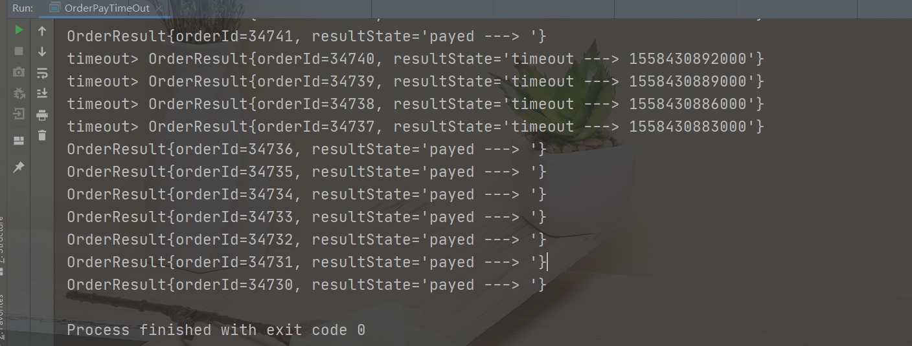

### 匹配订单支付超时 - ProcessFunction

#### 代码

~~~java
package com.wmy.orderPay.process;

import com.wmy.orderPay.beans.OrderEvent;
import com.wmy.orderPay.beans.OrderResult;
import org.apache.flink.api.common.state.ValueState;
import org.apache.flink.api.common.state.ValueStateDescriptor;
import org.apache.flink.configuration.Configuration;
import org.apache.flink.streaming.api.TimeCharacteristic;
import org.apache.flink.streaming.api.datastream.DataStream;
import org.apache.flink.streaming.api.datastream.SingleOutputStreamOperator;
import org.apache.flink.streaming.api.environment.StreamExecutionEnvironment;
import org.apache.flink.streaming.api.functions.AscendingTimestampExtractor;
import org.apache.flink.streaming.api.functions.KeyedProcessFunction;
import org.apache.flink.util.Collector;
import org.apache.flink.util.OutputTag;

import java.net.URL;

/**
 * ClassName:OrderTimeOutOnProcess
 * Package:com.wmy.orderPay.process
 *
 * @date:2021/6/25 18:02
 * @author:数仓开发工程师
 * @email:2647716549@qq.com
 * @Description: 判断订单超时事件，使用ProcessFuncton
 */
public class OrderTimeOutOnProcess {
    // 定义超时事件的侧输出流标签
    private final static OutputTag<OrderResult> orderTimeoutTag = new OutputTag<OrderResult>("order-timeout"){};

    public static void main(String[] args) throws Exception {
        StreamExecutionEnvironment env = StreamExecutionEnvironment.getExecutionEnvironment();
        env.setStreamTimeCharacteristic(TimeCharacteristic.EventTime);
        env.setParallelism(1);

        // 读取数据并转换成POJO类型
        URL resource = OrderTimeOutOnProcess.class.getResource("/OrderLog.csv");
        DataStream<OrderEvent> orderEventStream = env.readTextFile(resource.getPath())
                .map(line -> {
                    String[] fields = line.split(",");
                    return new OrderEvent(new Long(fields[0]), fields[1], fields[2], new Long(fields[3]));
                })
                .assignTimestampsAndWatermarks(new AscendingTimestampExtractor<OrderEvent>() {
                    @Override
                    public long extractAscendingTimestamp(OrderEvent element) {
                        return element.getTimestamp() * 1000L;
                    }
                });

        // 统一就一步操作，如果到点Pay还没有来的话，状态，定时器，process
        // 自定义处理函数，定义主流输出正常匹配订单事件，侧输出流超时报警事件
        SingleOutputStreamOperator<OrderResult> resultStream = orderEventStream
                .keyBy(OrderEvent::getOrderId)
                .process(new OrderPayMatchDetect());

        resultStream.print();
        resultStream.getSideOutput(orderTimeoutTag).print();
        env.execute("order timeout without cep job");
    }

    // 实现自定义的KeyedProcessFunction
    public static class OrderPayMatchDetect extends KeyedProcessFunction<Long, OrderEvent, OrderResult> {
        // 定义状态，保存之前订单是否已经来过create、pay的事件
        ValueState<Boolean> isPayedState;
        ValueState<Boolean> isCreateState;

        // 定义状态，保存定时器时间戳
        ValueState<Long> timerTsState;

        @Override
        public void open(Configuration parameters) throws Exception {
            // 这个名称必须是不一样的
            isPayedState = getRuntimeContext().getState(new ValueStateDescriptor<Boolean>("is-payed", Boolean.class, false));
            isCreateState = getRuntimeContext().getState(new ValueStateDescriptor<Boolean>("is-created", Boolean.class, false));
            timerTsState = getRuntimeContext().getState(new ValueStateDescriptor<Long>("timer-ts", Long.class));
        }

        @Override
        public void processElement(OrderEvent value, Context ctx, Collector<OrderResult> out) throws Exception {
            // 先获取当前的状态
            Boolean isPayed = isPayedState.value();
            Boolean isCreated = isCreateState.value();
            Long timerTs = timerTsState.value();

            // 判断当前事件类型
            if ("create".equals(value.getEventType())) {
                // 如果来的是create，要判断是否支付，乱序
                if (isPayed) {
                    // 如果已经正常支付，乱序，肯定离得很近，输出正常匹配结果
                    out.collect(new OrderResult(value.getOrderId(), "payed successfully 。。。"));
                    // 清空状态，删除定时器
                    isCreateState.clear(); // 这个应该是没有得
                    isPayedState.clear();
                    timerTsState.clear();
                    ctx.timerService().deleteEventTimeTimer(timerTs); // pay事件来了要不要也要注册一个定时器，无限等下去
                } else {
                    // 如果要是没有支付过，这个是正常得，注册15分钟得定时器，开始等待支付事件
                    Long ts = (value.getTimestamp() + 15 * 60) * 1000L;
                    ctx.timerService().registerEventTimeTimer(ts);
                    // 更新状态
                    timerTsState.update(ts);
                    isCreateState.update(true);
                }
            } else if ("pay".equals(value.getEventType())) {
                // 如果是pay事件，要判断是否 有下单事件来过
                if (isCreated) {
                    // 已经有过下单事件，继续判断当前得支付得时间戳，是否超过15分钟
                    if (value.getTimestamp() * 1000L < timerTs) {
                        // 这个在15分钟内，没有超时，正常匹配
                        out.collect(new OrderResult(value.getOrderId(), "payed successfully 。。。"));
                    } else {
                        // 已经超时，输出侧输出流报警
                        ctx.output(orderTimeoutTag, new OrderResult(value.getOrderId(), "payed but already timeout 。。。"));
                    }
                    // 统一清空状态，删除定时器
                    isCreateState.clear();
                    isPayedState.clear();
                    timerTsState.clear();
                    ctx.timerService().deleteEventTimeTimer(timerTs);
                } else {
                    // 没有下单事件，肯定是一个乱序，注册一个定时器，等待下单事件得到来
                    ctx.timerService().registerEventTimeTimer(value.getTimestamp() * 1000L); // 支付事件到来，肯定是下单事件，直接利用watermark得延迟，当前时间戳，不代表马上要触发
                    timerTsState.update(value.getTimestamp() * 1000L);
                    isPayedState.update(true);
                }
            }
        }

        @Override
        public void onTimer(long timestamp, OnTimerContext ctx, Collector<OrderResult> out) throws Exception {
            // 定时器触发，说明有一个事件没有来，如果都没有来，不可能有事件
            if (isPayedState.value()) {
                // 如果pay来了，说明create没有来，直接做一个报警
                ctx.output(orderTimeoutTag, new OrderResult(ctx.getCurrentKey(), "payed but not fount create event 。。。"));
            } else {
                // 如果pay没来
                ctx.output(orderTimeoutTag, new OrderResult(ctx.getCurrentKey(), "timout 。。。"));
            }

            // 清空状态
            isCreateState.clear();
            isPayedState.clear();
            timerTsState.clear();
        }
    }
}

~~~

#### 展示

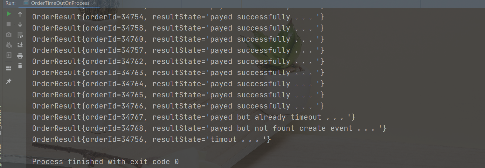

## 订单支付实时对账

### 基本需求

- 用户下单并支付后，应查询到账信息，进行实时对账
- 如果有不匹配的支付信息或者到账信息，输出提示信息

### 解决思路

- 从两条流中分别读取订单支付信息和到账信息，合并处理
- 用 connect 连接合并两条流，用 coProcessFunction 做匹配处理

### 连接流

#### 代码

~~~java
package com.wmy.orderPay.process;

import com.wmy.orderPay.beans.OrderEvent;
import com.wmy.orderPay.beans.ReceiptEvent;
import org.apache.flink.api.common.state.ValueState;
import org.apache.flink.api.common.state.ValueStateDescriptor;
import org.apache.flink.api.java.tuple.Tuple2;
import org.apache.flink.configuration.Configuration;
import org.apache.flink.streaming.api.TimeCharacteristic;
import org.apache.flink.streaming.api.datastream.DataStream;
import org.apache.flink.streaming.api.datastream.SingleOutputStreamOperator;
import org.apache.flink.streaming.api.environment.StreamExecutionEnvironment;
import org.apache.flink.streaming.api.functions.AscendingTimestampExtractor;
import org.apache.flink.streaming.api.functions.co.CoProcessFunction;
import org.apache.flink.util.Collector;
import org.apache.flink.util.OutputTag;

import java.net.URL;

/**
 * ClassName:TxPayMatch
 * Package:com.wmy.orderPay.process
 *
 * @date:2021/6/26 6:29
 * @author:数仓开发工程师
 * @email:2647716549@qq.com
 * @Description: 两条流对账的问题
 */
public class TxPayMatch {

    // 定义侧输出流标签
    private final static OutputTag<OrderEvent> unmatchedPays = new OutputTag<OrderEvent>("unmatched-pays"){};
    private final static OutputTag<ReceiptEvent> unmatchedReceipts = new OutputTag<ReceiptEvent>("unmatched-receipts"){};

    public static void main(String[] args) throws Exception {
        StreamExecutionEnvironment env = StreamExecutionEnvironment.getExecutionEnvironment();
        env.setStreamTimeCharacteristic(TimeCharacteristic.EventTime);
        env.setParallelism(1);

        // 读取数据并转换成POJO类型
        // 读取订单支付事件数据
        URL orderResource = TxPayMatch.class.getResource("/OrderLog.csv");
        DataStream<OrderEvent> orderEventStream = env.readTextFile(orderResource.getPath())
                .map( line -> {
                    String[] fields = line.split(",");
                    return new OrderEvent(new Long(fields[0]), fields[1], fields[2], new Long(fields[3]));
                } )
                .assignTimestampsAndWatermarks(new AscendingTimestampExtractor<OrderEvent>() {
                    @Override
                    public long extractAscendingTimestamp(OrderEvent element) {
                        return element.getTimestamp() * 1000L;
                    }
                })
                .filter( data -> !"".equals(data.getTxId()) );    // 交易id不为空，必须是pay事件

        // 读取到账事件数据
        URL receiptResource = TxPayMatch.class.getResource("/ReceiptLog.csv");
        SingleOutputStreamOperator<ReceiptEvent> receiptEventStream = env.readTextFile("E:\\bigdata\\bigdata-github-code\\UserBehaviorAnalysis\\OrderPayDetect\\src\\main\\resources\\ReceiptLog.csv")
                .map(line -> {
                    String[] fields = line.split(",");
                    return new ReceiptEvent(fields[0], fields[1], new Long(fields[2]));
                })
                .assignTimestampsAndWatermarks(new AscendingTimestampExtractor<ReceiptEvent>() {
                    @Override
                    public long extractAscendingTimestamp(ReceiptEvent element) {
                        return element.getTimestamp() * 1000L;
                    }
                });

        // 将两条流进行连接合并，进行匹配处理，不匹配的事件输出到侧输出流
        SingleOutputStreamOperator<Tuple2<OrderEvent, ReceiptEvent>> resultStream = orderEventStream.keyBy(OrderEvent::getTxId)
                .connect(receiptEventStream.keyBy(ReceiptEvent::getTxId))
                .process(new TxPayMatchDetect());

        resultStream.print("matched-pays");
        resultStream.getSideOutput(unmatchedPays).print("unmatched-pays");
        resultStream.getSideOutput(unmatchedReceipts).print("unmatched-receipts");

        env.execute("tx match detect job");
    }
    // 实现自定义CoProcessFunction
    public static class TxPayMatchDetect extends CoProcessFunction<OrderEvent, ReceiptEvent, Tuple2<OrderEvent, ReceiptEvent>> {
        // 定义状态，保存当前已经到来的订单支付事件和到账时间
        ValueState<OrderEvent> payState;
        ValueState<ReceiptEvent> receiptState;

        @Override
        public void open(Configuration parameters) throws Exception {
            payState = getRuntimeContext().getState(new ValueStateDescriptor<OrderEvent>("pay", OrderEvent.class));
            receiptState = getRuntimeContext().getState(new ValueStateDescriptor<ReceiptEvent>("receipt", ReceiptEvent.class));
        }

        @Override
        public void processElement1(OrderEvent pay, Context ctx, Collector<Tuple2<OrderEvent, ReceiptEvent>> out) throws Exception {
            // 订单支付事件来了，判断是否已经有对应的到账事件
            ReceiptEvent receipt = receiptState.value();
            if( receipt != null ){
                // 如果receipt不为空，说明到账事件已经来过，输出匹配事件，清空状态
                out.collect( new Tuple2<>(pay, receipt) );
                payState.clear();
                receiptState.clear();
            } else {
                // 如果receipt没来，注册一个定时器，开始等待
                ctx.timerService().registerEventTimeTimer( (pay.getTimestamp() + 5) * 1000L );    // 等待5秒钟，具体要看数据
                // 更新状态
                payState.update(pay);
            }
        }

        @Override
        public void processElement2(ReceiptEvent receipt, Context ctx, Collector<Tuple2<OrderEvent, ReceiptEvent>> out) throws Exception {
            // 到账事件来了，判断是否已经有对应的支付事件
            OrderEvent pay = payState.value();
            if( pay != null ){
                // 如果pay不为空，说明支付事件已经来过，输出匹配事件，清空状态
                out.collect( new Tuple2<>(pay, receipt) );
                payState.clear();
                receiptState.clear();
            } else {
                // 如果pay没来，注册一个定时器，开始等待
                ctx.timerService().registerEventTimeTimer( (receipt.getTimestamp() + 3) * 1000L );    // 等待3秒钟，具体要看数据
                // 更新状态
                receiptState.update(receipt);
            }
        }

        @Override
        public void onTimer(long timestamp, OnTimerContext ctx, Collector<Tuple2<OrderEvent, ReceiptEvent>> out) throws Exception {
            // 定时器触发，有可能是有一个事件没来，不匹配，也有可能是都来过了，已经输出并清空状态
            // 判断哪个不为空，那么另一个就没来
            if( payState.value() != null ){
                ctx.output(unmatchedPays, payState.value());
            }
            if( receiptState.value() != null ){
                ctx.output(unmatchedReceipts, receiptState.value());
            }
            // 清空状态
            payState.clear();
            receiptState.clear();
        }
    }
}
~~~

#### 展示结果

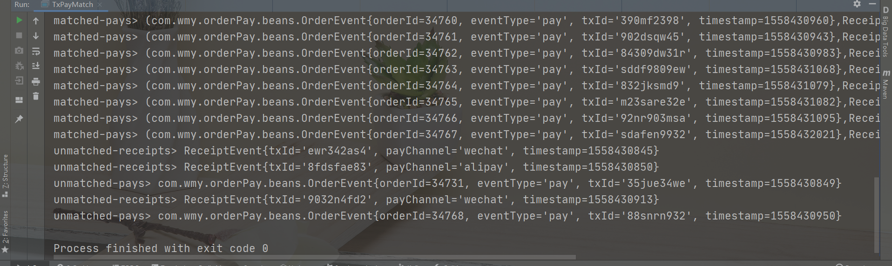

### join流

#### 代码

~~~java
package com.wmy.orderPay.process;

import com.wmy.orderPay.beans.OrderEvent;
import com.wmy.orderPay.beans.ReceiptEvent;
import org.apache.flink.api.java.tuple.Tuple2;
import org.apache.flink.streaming.api.TimeCharacteristic;
import org.apache.flink.streaming.api.datastream.DataStream;
import org.apache.flink.streaming.api.datastream.SingleOutputStreamOperator;
import org.apache.flink.streaming.api.environment.StreamExecutionEnvironment;
import org.apache.flink.streaming.api.functions.co.ProcessJoinFunction;
import org.apache.flink.streaming.api.functions.timestamps.AscendingTimestampExtractor;
import org.apache.flink.streaming.api.windowing.time.Time;
import org.apache.flink.util.Collector;

import java.net.URL;

/**
 * ClassName:TxPayMatchByJoin
 * Package:com.wmy.orderPay.process
 *
 * @date:2021/6/26 6:36
 * @author:数仓开发工程师
 * @email:2647716549@qq.com
 * @Description: 两条流的join
 */
public class TxPayMatchByJoin {
    public static void main(String[] args) throws Exception {
        StreamExecutionEnvironment env = StreamExecutionEnvironment.getExecutionEnvironment();
        env.setStreamTimeCharacteristic(TimeCharacteristic.EventTime);
        env.setParallelism(1);

        // 读取数据并转换成POJO类型
        // 读取订单支付事件数据
        URL orderResource = TxPayMatchByJoin.class.getResource("/OrderLog.csv");
        DataStream<OrderEvent> orderEventStream = env.readTextFile(orderResource.getPath())
                .map(line -> {
                    String[] fields = line.split(",");
                    return new OrderEvent(new Long(fields[0]), fields[1], fields[2], new Long(fields[3]));
                })
                .assignTimestampsAndWatermarks(new AscendingTimestampExtractor<OrderEvent>() {
                    @Override
                    public long extractAscendingTimestamp(OrderEvent element) {
                        return element.getTimestamp() * 1000L;
                    }
                })
                .filter(data -> !"".equals(data.getTxId()));    // 交易id不为空，必须是pay事件

        // 读取到账事件数据
        //URL receiptResource = TxPayMatchByJoin.class.getResource("/ReceiptLog.csv");
        SingleOutputStreamOperator<ReceiptEvent> receiptEventStream = env.readTextFile("E:\\bigdata\\bigdata-github-code\\UserBehaviorAnalysis\\OrderPayDetect\\src\\main\\resources\\ReceiptLog.csv")
                .map(line -> {
                    String[] fields = line.split(",");
                    return new ReceiptEvent(fields[0], fields[1], new Long(fields[2]));
                })
                .assignTimestampsAndWatermarks(new AscendingTimestampExtractor<ReceiptEvent>() {
                    @Override
                    public long extractAscendingTimestamp(ReceiptEvent element) {
                        return element.getTimestamp() * 1000L;
                    }
                });

        // 区间连接两条流，得到匹配的数据
        SingleOutputStreamOperator<Tuple2<OrderEvent, ReceiptEvent>> resultStream = orderEventStream
                .keyBy(OrderEvent::getTxId)
                .intervalJoin(receiptEventStream.keyBy(ReceiptEvent::getTxId))
                .between(Time.seconds(-3), Time.seconds(5))    // -3，5 区间范围
                .process(new TxPayMatchDetectByJoin());

        resultStream.print();

        env.execute("tx pay match by join job");
    }

    // 实现自定义ProcessJoinFunction
    public static class TxPayMatchDetectByJoin extends ProcessJoinFunction<OrderEvent, ReceiptEvent, Tuple2<OrderEvent, ReceiptEvent>>{
        @Override
        public void processElement(OrderEvent left, ReceiptEvent right, Context ctx, Collector<Tuple2<OrderEvent, ReceiptEvent>> out) throws Exception {
            out.collect(new Tuple2<>(left, right));
        }
    }
}
~~~

#### 展示结果

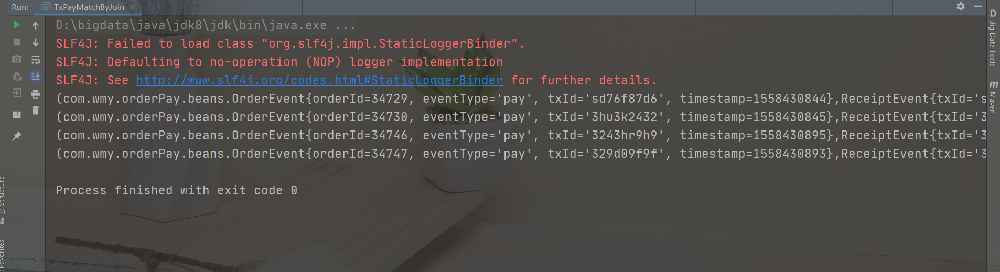

## CEP的介绍

~~~properties
CEP 复杂事件
	一个或多个由简单构成的事件流通过规则匹配
	Pattern API：
		模式 Pattern
		inputStream
		begin next subtype where followBy 没有说必须是严格紧邻
	个体模式 组合模式 模式组
	组合模式由限制：必须是pattern.begin
	模式组，模式序列作为条件嵌套在个体模式里面，成为一组模式，整个很复杂，一般是用不到的
	个体模式：singleton looping
	单列模式：当前的模式匹配的就是一个事件，可以检测到多个事件
	循环模式是可以接收多个事件。
	start.times(3).where(new SimpleCondition<Event>)
	
	量词：
		times(4) 当前模式匹配四次
		times(4).optional 可选，匹配出现零次或者四次
		start.times(2,4) 匹配2，4次
		start.times(2,4).gredy 贪婪模式，尽可能多的匹配
		start.oneOrMore.optional.gredy 并且尽可能多的匹配操作：0,2,*
	
	CEP底层是NFA是一个状态机的概念或者是架构
	
	简单的提取操作，好多过条件应该怎么办勒，& | ^ 在里面写的可读性比较差
	使用or 来 进行可读性的提高的，如果是and ---> where.where
	终止条件
		.until() oneOrMore 可以有多个，检测到一个匹配一个条件的，整个事件是没有完的，符合
		前面的条件就保存到Map事件中，
		
	迭代条件IterCondition
	严格近邻
	宽松近邻
	非确定性宽松近邻
~~~

## 启动流程和问题总结

~~~properties
hotItemsAnalysis 模块1
	数据量的话有48w条，但是在真实的场景中，是往往不够的。。。
	1、热门商品统计
		=================== 第一种实现方式 ===================
		1、KafkaProducerUtil：
			模拟Kafka生产
			
		2、HotItems：
			分配时间：assignTimestampsAndWatermarks
			增量聚合函数：AggregateFunction
			全窗口函数：WindowFunction
			状态管理：KeyedProcessFunction
			实现自定义输出
			换成Kafka消费

		先启动1、在启动2
		
		模拟实时的场景一定要启动1，在启动2，才能更好的达到测试效果。。。。
		=================== 第二种实现方式 ===================
		这个是采用读取文本的方式来进行测试的。。。
		也是可以采取Kafka的方式来进行数据流的获取。。。
		
		Flink SQL实现热门商品统计5分钟内统计最近一个小时的商品这样的话简单很多
		原因是我们不用写聚合函数
		但是我们在实现格式化输出的时候就不那么容易了。。。
		利用开窗函数，对count值进行排序并获取Row number，得到Top N
		必须得使用SQL来进行实现了。
		
		Table API这样实现的话就有点局限了，所以我们使用SQL方式来进行实现
		
		Table API 和 SQL 来回转换的方式来对我们的需求进行不断的去开发和优化。。。
		
		1、row_number
		2、order by 全局排序
		
		where 提前过滤，我们是排序之后 得到的结果，所以我们得做一个子查询。。。
		这样的格式就不是很好看，没有做格式化输出。。。
		
		3、toRetractStream
		做聚合的时候，数据是会发生变化的额，窗口是会发生变化的，现在只有开窗函数了所以得进行定向
		
		(false,-U[138964, 11, 2017-11-26T02:15, 5]) 更新之前
		(true,+U[3034696, 11, 2017-11-26T02:15, 5]) 更新之后
		
		这个数据收集是非常麻烦得，可以写入MySQL里面，TopN来进行查看
		
		4、能不能使用纯SQL的方式来实现这个需求勒。
		当然是可以的。。。

NetworkFlowAnalysis 模块2
	首先进行所有页面的统计，然后对PV，UV单独进行分析的处理。。。
	热门页面 --- 只有一万条数据
	1、ApacheLogEvent
	2、PageViewCount
	3、UserBehavior
	4、HotPages
	5、AggregateFunction
	6、WindowFunction
	7、KeyedProcessFunction ---> 状态编程和触发器的使用
	记住关于Flink中的key是String还是Tumble类型的，是看我们返回的类型是什么，所以这个在编程的时候一定要特别注意。
	
	安装了redis，但是在启动的时候，要注意先启动./bin/redis-server 然后 在 ./bin/redis-cli -h 192.168.22.140
	
	pv 页面统计：
	做一个状态编程和触发器
	open ---> 做一个状态句柄，可以给定一个初始值，考虑刚开始就为null值的情况了
	processElement ---> 更新状态值、和注册触发器
	onTimer  ---> 定时器触发的时候，所有窗口的数据都是到齐了
	当前的TotalCount就是状态的值
	清空当前的状态 totalCounState.clear()
	

	问题：
		Redis安装：
			编译安装的时候，需要把src里面的东西拿过来，单独启动server，要不然就会出现客户端连接不上
			
		求PV的时候，分组使用的是map给定一个固定的key
		并行测试：
			KeyBy，分组全部分到一个分区，避免用WindowAll分到同一个分区，这样就没有办法用到并行。。。
		解决办法：
			数据倾斜的问题？？？
			资源利用率较低，如何去解决，如何把key均匀分配到分区上，就会达到负载均衡的作用
			随机生成key，求HashCode % 可能会分配到同一个分区中，一般都比分区数大一点
			如何将每个分区全聚合操作。。。
			如何直接分组，然后sum，这样就是每个元素都得走一遍，效率极差
			应该使用AGG然后全窗口来进行实现。。。
			来一个数据处理一次，得到得URL，当前得分区里面，一个URL就有一个count值
			
	UV独立访问用户数
		timeWindowAll ---> AllWindowFunction
		去重的话，我们第一种是采用的是全窗口的方式，就是采用的Set数据结构，对内存的压力比较大
		如果UserId比较多的话，采用这种方式的就不太好了。。。
		但是极端的场景下Redis，Redis可能也存不下
		上亿的数据量，UserId 几十个字节到几百个字节
		100Bit 10^8*100 = 10^10Bit 
		10^3 = 1K
		10^9 = 1G
		10^10 = 10GB
		这样的话太大了，一个窗口一个任务存了10个G，用来专门保存一个状态
		如何进行优化：不太适合用存储工具做考虑
		🍙采用存储结构 ---> 布隆过滤器，存储的是很大的位图，位图存放的bit，bitMap
		思想：
			01状态表示UserId是否存在，一个UserId，对应某一位，1表示存在，bitMap有多少1表示多少UserId存在
			压缩的对应，100Bit ---> 1Bit
			一亿占用空间 ---> 10^8Bit = 100Mb / 8 ---> 12.5Mb
			每个UserId严格对应bitMap的每一位，用一个Hash计算做对应选择，UserId来了之后求HahsCode，对应的offset，一个bitMap对应 一个数组
			不同UserId，HashCode出现HashCode碰撞，稍微出现一点散列，就会出现
			扩充bitMap，处理一亿的数据，相当于全部分散开
			原则：HashFunction选取，BitMap的扩充，碰撞概率无限趋向于零
			布隆过滤器是一个概率性的算法。
			主要问题：hash碰撞
			特点重要重要的一点：Google Grave算法，现成的，传入一个所容忍的碰撞概率，默认是0.03。。。
		不要做Process，定义一个计算规则，每来个计算触发一个计算，连接Redis，中间判断
		以前做一个增量聚合函数也使用过这种思想，但是使用Redis来实现就会有点复杂

	作为扩展：
		🍙自定义窗口触发器
		🍙Flink自带的布隆过滤器
		🍙MurmurHash

	如何去计算布隆过滤器的大小：
		一亿数据去重
		2的整数倍大小Mb
		64Mb ---> 多少bit
		2^6 2^20 2^3 ---> 2^29

	如何去测试这个布隆过滤器：
		启动./bin/redis.server
		redis-cli -h 192.168.22.140
		然后启动RedisDesktop来进行查看
		启动UvWithBloomFilter	
		
market_analysis 模块3
	AppMarketingByChannel 按照不同的渠道做的一个市场的推广的统计
	AppMarketingStatistics ---> 
		keyby ---> 不分渠道的市场推广，这个指定的是一个固定的key，就是全量聚合的一个操作
		
	WindowFunction
	ProcessWindowFunction
	主要是有无生命周期 context,window ---> 全集和子集的一个概率
	全量和增量的区别的重要性。。。。
	
	市场推广：MarketingUserBehavior | ChannelPromotionCount
	
	页面广告投放：
		AdClickEvent | AdCountViewByProvince
		直接统计当前页面的点击，count + 1
		精细化划分，按照用户的地理位置来进行划分，用户被点击的热门程度是否是和地理位置有关系
		南北差异还是比较大的
		AdStatisticsByProvince
		添加了报警机制，就是刷单的用户行为，定义一个标志状态，保存当前是否已经被发送到了黑名单里面
		
	状态清空处理，注册一个定时器，注册一个第二天零点定时器
	如何去定义一个时间戳，既然是零点，先获取当前的处理时间
	如何拿到第二天零点的数据
	毫秒总数 / 
	(ctx.timerService().currentProcessingTime() / (24*60*60*1000) + 1) * (24*60*60*1000) - 8*60*60*1000;
	
	ctx.timerService().currentProcessingTime() 从1970-01-01 到现在的所有毫秒数
	(24*60*60*1000) 一天当中的毫秒数
	(ctx.timerService().currentProcessingTime() / (24*60*60*1000) + 1) 这个是明天的天数
	(ctx.timerService().currentProcessingTime() / (24*60*60*1000) + 1) * (24*60*60*1000)
	这个是第二天零点的时间戳
	
	有时差，伦敦时间的时区
	减去时区
	
LoginFailDetect 模块4 
	恶意登录事件
	定义触发器
		等到两秒钟才判断失败次数，这样的话超过上次，两秒钟那种，黑客可以无限的攻击，尽可能快的
		监控到，不一定得要等到两秒钟检测到。。。
		从时效性上来说，需要改进。。。
	对这个实现自定义的监测事件需要继续取优化它。。。
	监控状态一般都是配合那个触发器来结合一起使用
	当前代码的缺陷：如果不是以两秒钟来进行代码监控的话，这样我们的代码逻辑也是需要更改的
	代码的灵活性就比较差，我们没有使用触发器，只是针对于次数来进行监控，这样的时效性要好得多。。。
	
	问题就是：
		Flink和触发器的使用心得。。。
		触发器得使用和尽快得得到监测结果，这个一定要注意使用，否则可能会和我们的需求有违背。。。
	
	使用CEP来进行风控处理
		乱序顺序的影响，可能会打算我们的影响
		如果使用定时器，也不能解决这个问题，之前做的两种清空，都没有办法处理这些报警
		事件触发的基础上，在去注册一个定时器，按照watermark，42的定时器，等到watermark到达42才能
		触发。处理之前的事件，这样的话就是延迟触发，等待它触发窗口执行。
		采用CEP来检测登录失败的方式要比上面的要简单一点，感受这种使用方式的话要比ProcessFunction要
		简单很多。。。

CEP 复杂事件
	一个或多个由简单构成的事件流通过规则匹配
	Pattern API：
		模式 Pattern
		inputStream
		begin next subtype where followBy 没有说必须是严格紧邻
	个体模式 组合模式 模式组
	组合模式由限制：必须是pattern.begin
	模式组，模式序列作为条件嵌套在个体模式里面，成为一组模式，整个很复杂，一般是用不到的
	个体模式：singleton looping
	单列模式：当前的模式匹配的就是一个事件，可以检测到多个事件
	循环模式是可以接收多个事件。
	start.times(3).where(new SimpleCondition<Event>)
	
	量词：
		times(4) 当前模式匹配四次
		times(4).optional 可选，匹配出现零次或者四次
		start.times(2,4) 匹配2，4次
		start.times(2,4).gredy 贪婪模式，尽可能多的匹配
		start.oneOrMore.optional.gredy 并且尽可能多的匹配操作：0,2,*
	
	CEP底层是NFA是一个状态机的概念或者是架构
	
	简单的提取操作，好多过条件应该怎么办勒，& | ^ 在里面写的可读性比较差
	使用or 来 进行可读性的提高的，如果是and ---> where.where
	终止条件
		.until() oneOrMore 可以有多个，检测到一个匹配一个条件的，整个事件是没有完的，符合
		前面的条件就保存到Map事件中，
		
	迭代条件IterCondition
	严格近邻
	宽松近邻
	非确定性宽松近邻
	
订单支付 Model 5
	设置失效时间 ---> Redis 有失效时间，状态保存到Redis中
	查订单，直接去Redis中查看就行，返回订单不能失效的问题
	放到Redis业务系统中，时效性就不是很好，不能很好的展示，想要做到立刻生效，就得轮询
	整个过程在实际中有很多问题。
	解决方案 ：
		离线处理，实时那边，订单就无法判断，就会出现订单异常
		实时处理，承接业务系统的功能
	订单失效的实时监控：
		1、导入CEP依赖信息
		2、模块处理 ---> 埋点数据，用户订单里面的信息UserBehavior信息，没有下单和支付
		单独找数据，34729,create,,1558430842 ---> OrderId,operation,transation_code,timestamp --->  ETL处理
		OrderEvent ---> 设置延迟事件和定时器（15分钟）---> 成功支付（支付超时）---> 很容易实现检测
		orderId 当前整个Id失效，超时输出
		OrderEvent ---> OrderResult ---> OrderPayTimeOut
		CEP ---> 中间就算有乱序是没有影响的，只要判断当前的create pay 只要弄清楚就行，if else
	
	ProcessFunction 判断超时的检测
	没有CEP的处理方式
	现在开始做超时监测，明天在做。。。
	启动进程：redis kafka flink
	
	public static class OrderPayMatchDetect extends KeyedProcessFunction
	
	OrderTimeOutOnProcess 代码比CEP复杂了，但是可以更控制细粒度得事件。。。

实时到账
	第三方支付平台，有可能订单的请求会出现数据丢失
	交易码   ，渠道 ，  时间
	ewr342as4,wechat,1558430845
	两种情况：
		TxPayMatch 对账
~~~

